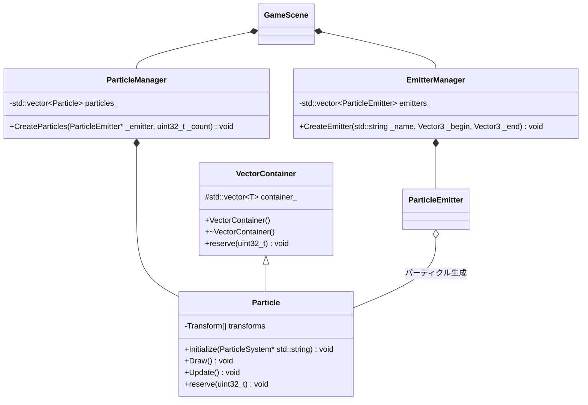

```mermaid

classDiagram
direction BT


ParticleManager --* GameScene
EmitterManager --* GameScene
ParticleEmitter --* EmitterManager
Particle --* ParticleManager
Particle --o ParticleEmitter : パーティクル生成
Particle --|> VectorContainer

class ParticleManager{
    +CreateParticles(ParticleEmitter* _emitter, uint32_t _count) void
    -std::vector~Particle~ particles_
}

class EmitterManager{
    +CreateEmitter(std::string _name, Vector3 _begin, Vector3 _end) void
    -std::vector~ParticleEmitter~ emitters_
}

class ParticleEmitter

class Particle{
    +Initialize(ParticleSystem* std::string) void
    +Draw() void
    +Update() void
    +reserve(uint32_t) void
    -Transform[] transforms
}

class VectorContainer{
    +VectorContainer()
    +~VectorContainer()
    +reserve(uint32_t) void
    #std::vector~T~ container_
}

```