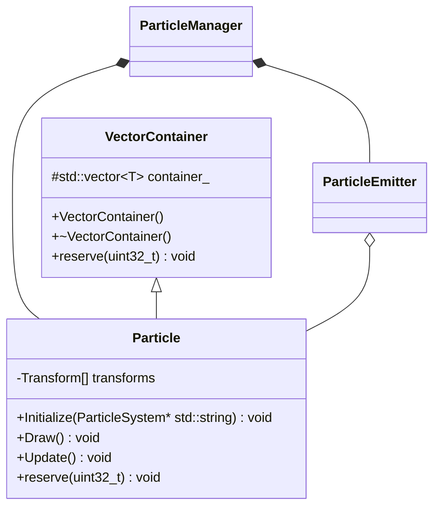

## [branch:main](https://github.com/Souto-Naitou/GameEngine_DX12/tree/customized03)
|Debug|Release|
|:---:|:---:|
||

```mermaid

classDiagram
direction BT

Particle --* ParticleManager
Particle --o ParticleEmitter
Particle --|> VectorContainer
ParticleEmitter --* ParticleManager

class ParticleManager

class ParticleEmitter

class Particle{
    +Initialize(ParticleSystem* std::string) void
    +Draw() void
    +Update() void
    +reserve(uint32_t) void
    -Transform[] transforms
}

class VectorContainer{
    +VectorContainer()
    +~VectorContainer()
    +reserve(uint32_t) void
    #std::vector~T~ container_
}

```
